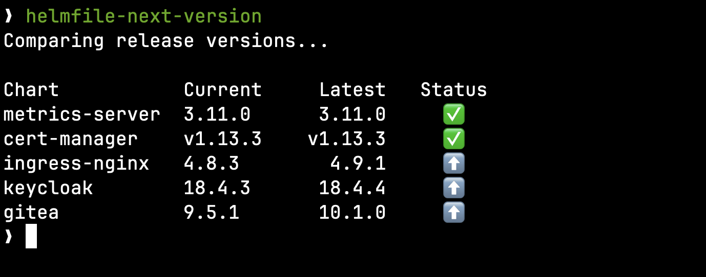

# helmfile-next-version

A tool that shows which helmfile releases have a newer chart version available.



### Build instructions

```sh
make build
```

### Getting started

> [!NOTE]
> Before this can be used helm must be in your `PATH` and helm chart repos used by your helmfile must have already been added via helmfile or helm.

Run the command without arguments.

```sh
helmfile-next-version
```

Show the help for more options.

```sh
helmfile-next-version -h
```
